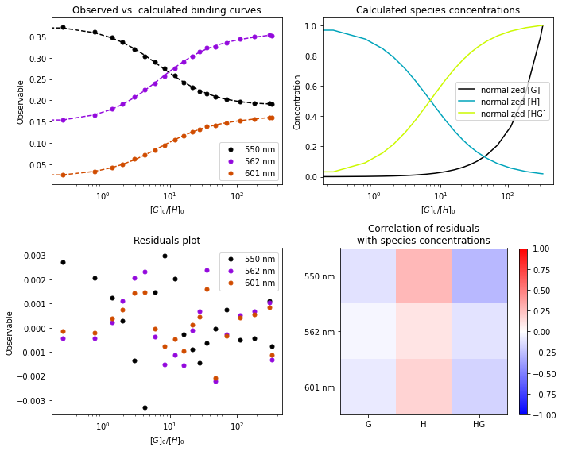

# pyassconst / bindfit
Determination of association/binding constants from titration data using any system of equilibria

## Functionality
1. Numerical simulation of equilibrium concentrations from a set of initial concentrations and a system of equilibria, given the equilibrium constants
2. Calculation of binding curves from the equilibrium concentrations, given a matrix of epsilon values
3. Fitting of calculated binding curves to experimental binding curves, given initial guesses of epsilon and equilibrium constants

## Full description
A full description is given in the [Jupyter notebook](How-to.ipynb), since it can render maths.

A description of the mathematics used in setting up the system of equilibria, and solving for the equilibrium concentrations, check [background.pdf](background.pdf).

## A picture says more than 1000 words

